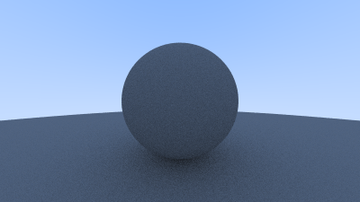

# Ray Tracing in One Weekend -- C++ Implementation

Building a path tracer from scratch following Peter Shirley's *Ray Tracing in One Weekend* book series.

## Latest Render

<!-- update-zone -->

<!-- /update-zone -->

## Implemented So Far

- Vec3 math library (vector arithmetic, dot/cross product, unit vectors)
- Ray class with origin/direction and parameterized point evaluation
- Color output with PPM image format
- Image rendering pipeline with progress reporting
- Gradient background (sky) based on ray direction

## Build

```
cmake -S . -B build
cmake --build build
```

Compiles with `g++ -std=c++17 -O2` through CMake.

## Render

```
./build/raytracer > renders/output.ppm
convert renders/output.ppm renders/output.png
```

Outputs a PPM image to `renders/output.ppm` and converts it to the PNG shown above. The GitHub Actions workflow refreshes `renders/output.png` automatically after rendering-related changes are pushed to `main`.

## Clean

```
make clean
```
