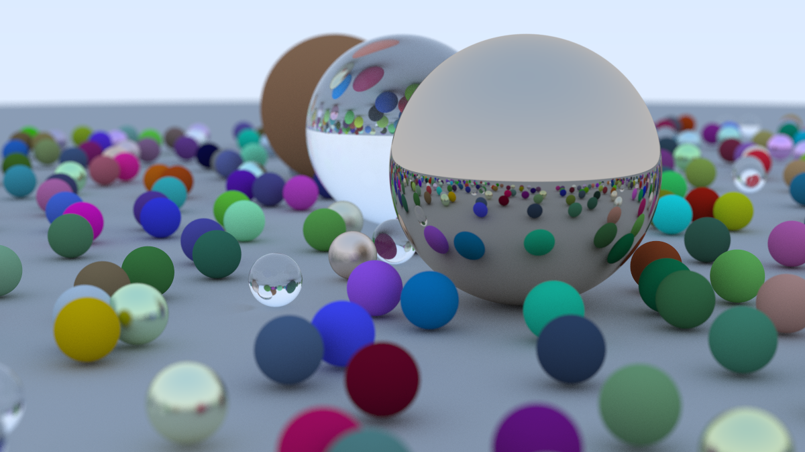

# Ray Tracing in One Weekend -- C++ Implementation

Completed path tracer built from scratch following Peter Shirley's *Ray Tracing in One Weekend*.

## Final Render

<!-- update-zone -->

<!-- /update-zone -->

## Features

- Vec3 math library (vector arithmetic, dot/cross product, unit vectors)
- Ray class with origin/direction and parameterized point evaluation
- Camera with configurable FOV, aperture, and focus distance
- Antialiasing via multi-sample averaging
- Diffuse (Lambertian), metal, and dielectric (glass) materials
- Positionable camera with depth-of-field blur
- Final scene: large random sphere field with three featured spheres

## Build

```
cmake -S . -B build
cmake --build build
```

Compiles with `g++ -std=c++17 -O2` through CMake.

## Render

```
./build/raytracer > renders/output.ppm && magick renders/output.ppm renders/output.png
```

Outputs a PPM image and converts it to PNG. The GitHub Actions workflow refreshes `renders/final_view.png` automatically after rendering-related changes are pushed to `main`.

## Clean

```
rm -rf build
```
